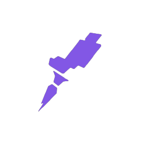

<h1 align="center">Hello 😃, I'm</h1>

  
  <h2 align="center"><strong>Web Developer - Front-end</strong></h2>

Olá me chamo Thales, sou desenvolvedor front-end e atualmente trabalho na VH consultoria e sistemas com reactjs e angular. 😉

  <h2>🚀 Habilidades</h2>
<!-- ********************************* Tenho experiência ******************************************** -->
  

    <h3>Tenho experiência</h3>
    &ensp;&ensp;
    &ensp;&ensp;
    &ensp;&ensp;
    &ensp;&ensp;
    &ensp;&ensp;
    &ensp;&ensp;
    &ensp;&ensp;
    &ensp;&ensp;
    
  

<!-- ********************************* Minhas Ferramentas ******************************************** -->
  

    <h3>Minhas ferramentas</h3>
    &ensp;&ensp;
    &ensp;&ensp;
    &ensp;&ensp;
    &ensp;&ensp;
    &ensp;&ensp;
    &ensp;&ensp;
    &ensp;&ensp;
  

  <h2 align="center">📊 Estatísticas</h2>

   
  

  <h2>📫 Contato e outras redes</h2>
  <a href="https://www.linkedin.com/in/thalesousa/" target="blank">&ensp;&ensp;</a>
  <a href="mailto:thalestjsb@gmail.com" target="blank">&ensp;&ensp;</a>
  <a href="https://app.rocketseat.com.br/me/thalesousa" target="blank">&ensp;</a>
  

