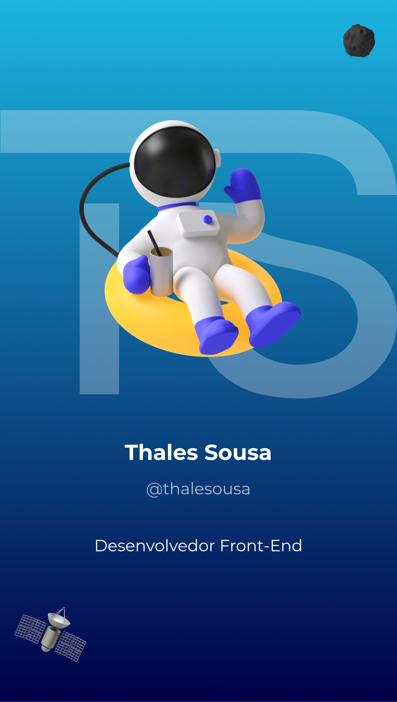

<h1 align="left">Hi , I'm Thales Sousa</h1>

- 🔥 Junior Web Developer focado em desenvolvimento front-end.
- 🎓 Formado em sistemas de informação (UFPI).
- 🔭 Atualmente trabalhando na <a href="https://vh.com.br/" target="_blank">Vh Consultoria e Sistemas</a>.
- 💬 Pergunte-me sobre **JavaScript, HTML, CSS, React.js.**
- 👨‍💻 Veja mais em [thalesousa.vercel.app](https://thalesousa.vercel.app).

### Experiência

### Já trabalhei também

### Ferramentas

### Contato

