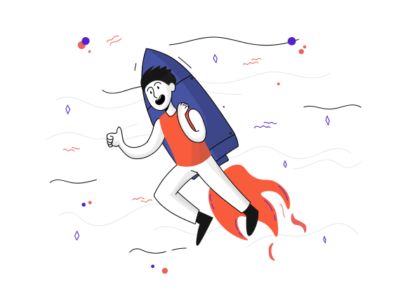

<h1 align="center">Hello 😃, I'm</h1>

  
  <h2 align="center"><strong>Web Developer - Front-end</strong></h2>

Olá me chamo Thales, sou desenvolvedor front-end e atualmente estou graduando em Sistemas de Informação pela UFPI de Picos/PI, também faço o ignite da rocketseat na trilha front-end com reactjs e estou disponível para trabalho. 😉

  <h2>🚀 Habilidades</h2>
<!-- ********************************* Tenho experiência ******************************************** -->
  

    <h3>Tenho experiência</h3>
    &ensp;&ensp;
    &ensp;&ensp;
    &ensp;&ensp;
    &ensp;&ensp;
    &ensp;&ensp;
    &ensp;&ensp;
    &ensp;&ensp;
    &ensp;&ensp;
  

<!-- ********************************* Minhas Ferramentas ******************************************** -->
  

    <h3>Minhas ferramentas</h3>
    &ensp;&ensp;
    &ensp;&ensp;
    &ensp;&ensp;
    &ensp;&ensp;
    &ensp;&ensp;
    &ensp;&ensp;
    &ensp;&ensp;
  

<!-- ********************************* Estou Estudando ******************************************** -->
  

    <h3>Estou estudando</h3>
    &ensp;&ensp;
    &ensp;&ensp;
    &ensp;&ensp;
    &ensp;&ensp;
  

  <h2>📫 Contato</h2>
  <a href="https://www.linkedin.com/in/thalesousa/" target="blank">&ensp;&ensp;</a>
  
  

<!-- - 🌎 I'm from Picos - Piauí, Brasil 🇧🇷 
- 🌱 I’m currently learning ReactJS and Typescript.
- 🎓 Study at the Federal University of Piauí.
- 📫 How to reach me: thalestjsb@gmail.com -->